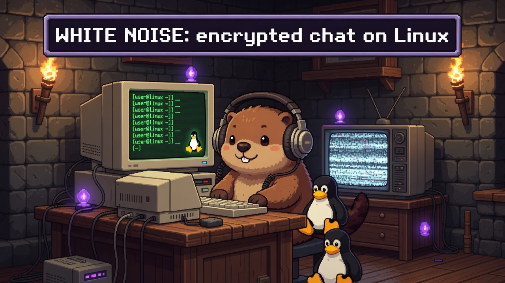

<p align="center">
  
</p>

<h1 align="center">White Noise Linux</h1>

<p align="center"><b>A native desktop client for end-to-end encrypted group chat over Nostr.</b></p>

<p align="center">
  <a href="https://github.com/marmot-protocol/whitenoise-linux/actions/workflows/ci.yml"></a>
  <a href="LICENSE"></a>
  
  
</p>

---

White Noise is a desktop front end for [Marmot](https://github.com/marmot-protocol/darkmatter): [MLS](https://messaginglayersecurity.rocks/) group messaging carried over [Nostr](https://nostr.com) relays. You get the forward secrecy and post-compromise security of MLS together with a portable, self-owned Nostr identity: no phone number, no central server, no account anyone can take away from you. It's one Rust binary with a [Slint](https://slint.dev) UI, and every secret lives in a single password-encrypted vault.

> **Status: `v0.1.0`.** It works and is usable day-to-day, but it's early and moving fast, so expect rough edges.

**Jump to:** [Features](#features) · [Install](#install-a-release) · [Build from source](#build-from-source) · [Configuration](#configuration) · [Architecture](#architecture) · [Development](#development) · [Contributing](#contributing) · [License](#license)

## Features

**Messaging**
- One-to-one and group chats, end-to-end encrypted through Marmot's MLS, with sealed-sender invites over NIP-59.
- Markdown bodies (CommonMark + GFM + inline nostr entities), reactions, replies, and edits with history.
- A durable on-disk send queue, so messages written offline aren't lost and go out on reconnect.
- Per-chat unread tracking, surfaced as rail badges and an aggregate count in the window title.

**Media**
- Image album grids, inline video (via libmpv), and voice messages, all over Marmot's encrypted MIP-04 path.
- Profile pictures are the one deliberate exception: they go out publicly via Blossom.

**Identity & accounts**
- Several accounts at once: every Nostr identity keeps a live Marmot worker receiving in the background, and switching accounts just changes which one is on screen.
- Contacts and follow lists, private local-only per-contact nicknames, an archive, and npub QR codes.

**Look & feel**
- Three themes (modern dark, warm light, and a full SNES-era retro skin with a pixel font), plus five accent colors.
- English, Italian, German, and Japanese, switchable at runtime.
- Native desktop notifications.

**Privacy & data**
- One password-encrypted vault holds every secret (see [Security model](#security-model)).
- Whole-folder encrypted backup and restore, sealed with your vault password.
- Opt-in OTLP metrics and audit logging, both off until you turn them on in Settings.

## Security model

The whole app is one Rust binary with no OS keyring, no `pass`, and no plaintext key on disk. Every secret (your nsec, Marmot's per-account MLS keys, the decrypted media cache) lives in a single vault file (`vault.db`) sealed with XChaCha20-Poly1305 under a key derived from your password with Argon2id.

The flip side is that **there is no recovery**: lose the password and the data is gone. Take a [backup](#features) if that matters to you; the backup is sealed with the same vault password, so a restore needs exactly one secret.

## Install a release

Pre-built tarballs are on the [Releases](https://github.com/marmot-protocol/whitenoise-linux/releases) page:

| Platform | Target |
| --- | --- |
| Linux x86-64 | `x86_64-unknown-linux-gnu` |
| Linux ARM64 | `aarch64-unknown-linux-gnu` |
| macOS (Apple Silicon) | `aarch64-apple-darwin` |

```sh
tar xzf whitenoise-linux-<target>.tar.gz
cd whitenoise-linux-<target>
./whitenoise-linux
```

You'll still need the runtime libraries listed under [Build from source](#build-from-source).

## Build from source

You need a current Rust toolchain (edition 2024) and a handful of C libraries for media, fonts, audio, and notifications.

**Debian / Ubuntu:**

```sh
sudo apt-get install -y pkg-config libmpv-dev libfontconfig-dev libasound2-dev libdbus-1-dev
```

**macOS (Homebrew):**

```sh
brew install mpv pkgconf
export PKG_CONFIG_PATH="$(brew --prefix)/lib/pkgconfig"
```

**Then:**

```sh
git clone https://github.com/marmot-protocol/whitenoise-linux
cd whitenoise-linux
cargo run
```

The first build takes a while: it fetches the Marmot crates, compiles a very large generated Slint UI module, and composes the Twemoji sprite sheet. After that, incremental builds are quick: editing Rust under `src/` rebuilds only the root crate (a couple of seconds), while touching `.slint` or `lang/` files rebuilds the UI crate (~25s). The Marmot crates are pulled anonymously over HTTPS from the public [`marmot-protocol/darkmatter`](https://github.com/marmot-protocol/darkmatter) repo, so there's no SSH key or token to set up.

### First run

The first time you launch, you either paste an existing nsec or generate a new one, and you set a vault password. That creates the vault; from then on you just enter the password to open it. A wrong password fails the cipher's authentication tag, so there's no recovery path, but the login screen has a **Use another key** option that wipes the vault and starts over from a fresh nsec.

## Configuration

A few environment variables matter at runtime:

| Variable | Effect |
| --- | --- |
| `DM_HOME` | Where the vault, media cache, and observability override live. Defaults to the platform's standard data directory for `darkmatter`. |
| `RUST_LOG` | `tracing` filter; logs go to stderr, defaulting to `info`. |
| `WAYLAND_DISPLAY` / `DISPLAY` | Selects the clipboard backend: prefers `wl-copy` on Wayland, falls back to `xclip`, `xsel`, or `arboard` on X11. |

UI preferences (theme, accent, locale, which side your own messages sit on, nicknames) live in a small JSON file in your XDG config directory. Telemetry and audit-log endpoints are configured in `observability.toml`, but nothing is ever sent until you enable the toggles under **Settings**, in the **Advanced** section.

### Deep links (`marmot://`)

Profile QR codes encode `marmot://profile/<npub>?from=qr`, the scheme shared by all Marmot clients. The app handles these links when they arrive as a command-line argument or are pasted into **Add contact**, and `marmot://profile/…` anchors inside chats open the in-app profile view. To have your desktop hand `marmot://` links to White Noise, install the bundled desktop entry (edit `Exec=` if the binary isn't on your `PATH`):

```sh
install -Dm644 assets/whitenoise-linux.desktop ~/.local/share/applications/whitenoise-linux.desktop
update-desktop-database ~/.local/share/applications
xdg-mime default whitenoise-linux.desktop x-scheme-handler/marmot
```

## Architecture

Top to bottom:

```
 Slint UI (ui/*.slint)
        │   compiled once into a generated module
        ▼
   wnl-ui crate   : owns slint::include_modules!()
        │
        ▼
   src/main.rs   : ~13.5k lines of callback glue plus the optimistic-overlay state machine
        │
        ▼
  src/backend.rs : wraps MarmotApp and its own tokio runtime (~2.7k lines)
        │
        ▼
  MarmotApp       : MLS groups, Nostr relays, sealed secrets
```

It reads flat by intent: there are no per-feature abstractions, and the data flow for any UI action reads straight through. The UI glue is chaptered across a handful of files only to honor a hard rule — **no Rust file may exceed 2000 lines** (enforced by the pre-commit hook) — but they share one crate-root prelude (`pub(crate) use` re-exports, pulled in with `use crate::*;`), so they behave like one file. `main.rs` builds the window and the shared context (`Cx` handles + `Handlers` closures) and calls the `wire_*` functions; the callback sections live under `src/wiring/` (`panes.rs`, `backup.rs`, `messaging.rs`, `extra.rs`) and the pure row/render/state helpers in `chatmodel.rs` / `chatlist.rs` / `chrome.rs` / `media.rs` / `render.rs` / `state.rs`. The other real split is the `wnl-ui` crate: the generated Slint module is enormous, so isolating it keeps everyday Rust edits from triggering a full UI recompile.

| Path | What's there |
| --- | --- |
| `src/main.rs`, `src/wiring/` | UI callback wiring (`main.rs` builds the context and calls the `wire_*` functions in the `wiring/` submodules) |
| `src/chatmodel.rs`, `chatlist.rs`, `chrome.rs`, `media.rs`, `render.rs`, `state.rs` | The chat-row build pipeline, list/chrome refreshers, markdown/avatar rendering, and the optimistic overlay |
| `src/backend.rs`, `src/backend/groups.rs` | The `MarmotApp` wrapper, the tokio runtime, and all platform-specific bits (clipboard, paths) |
| `src/vault.rs` | The password-encrypted secret vault |
| `src/backup.rs` | Whole-folder encrypted backup and restore (`.dmbackup`), sealed with the vault password |
| `src/media_cache.rs` | Encrypted-at-rest cache for decrypted attachment bytes |
| `src/blossom.rs` | Public Blossom uploads, used only for profile pictures |
| `src/mpv.rs`, `src/audio.rs` | Inline video over libmpv, and voice-message capture and playback |
| `src/offline_queue.rs` | The durable outgoing-message queue |
| `src/unread.rs` | Per-chat unread tracking behind the rail badges and the window-title count |
| `src/animal_avatar.rs` | Deterministic starter avatars drawn over an npub-derived gradient |
| `src/settings.rs`, `src/observability.rs`, `src/notify.rs` | UI prefs, telemetry config, desktop notifications |
| `wnl-ui/` | The build-isolation crate that compiles the Slint tree and the emoji sprite sheet |
| `ui/` | The Slint component tree; `tokens.slint` holds shared structs and theme globals, and `ui/CONTRACT.md` documents the theming engine |
| `lang/` | gettext catalogs (`en`, `it`, `de`, `ja`), bundled at build time |
| `assets/` | Logo, fonts, and the SVG starter-avatar set |

A few design choices are worth knowing before you dig in:

- **Optimistic rendering.** Sending, reacting, and unreacting apply to a local overlay first and repaint immediately, then reconcile against Marmot's response. The UI never blocks on the network round-trip.
- **Two upload paths.** Chat attachments go through Marmot's encrypted MIP-04 path, readable only by group members. Profile pictures take the deliberately public Blossom path.
- **Three-way theming.** Every color token branches across modern, light, and retro. A new component has to cover all three and read accent colors from the `Theme` global instead of hardcoding them.

For the deeper details (vault format, the avatar pipeline, the i18n setup, and the Slint conventions specific to this repo), see [`AGENTS.md`](AGENTS.md).

## Development

```sh
cargo build                      # build everything
cargo run                        # run the app
scripts/update-translations.sh   # regenerate gettext catalogs after editing @tr() strings
```

There's no unit-test suite yet: `cargo test` is a no-op, and changes are verified by running the app. End-to-end testing (a QEMU VM harness, a headless control daemon, and multi-VM messaging scenarios) lives in the separate [`darkmatter-automated-testing`](https://github.com/marmot-protocol/darkmatter-automated-testing) repo, which builds this checkout.

To develop against a local Marmot checkout, add a `[patch]` to `.cargo/config.toml` instead of editing `Cargo.toml`; the exact stanza is in [`AGENTS.md`](AGENTS.md).

## Contributing

Issues and pull requests are welcome. If you're working with an AI coding agent, point it at [`AGENTS.md`](AGENTS.md) first; it has the architecture and conventions in more detail than this file.

Before your first commit, install the project git hooks (**required**):

```sh
scripts/install-hooks.sh
```

This points `core.hooksPath` at the tracked `.githooks/` directory and registers the `po-clean` catalog filter, so the same checks CI enforces run locally before you commit. The `pre-commit` hook:

- **Normalizes gettext catalogs** (`*.po` / `*.pot`): strips source-line references and the volatile `POT-Creation-Date` header and sorts by message id, so unrelated line shifts never surface as catalog diffs or merge conflicts. Needs `gettext` (`msgcat`); without it the hook still strips the date header. The same normalization runs automatically on `git add` via the filter, and CI rejects any catalog that isn't normalized.
- **Gates Rust / Slint / Cargo changes** on `cargo fmt --all -- --check` and `cargo clippy --all-targets -- -D warnings`, the same gates CI runs. Run `cargo fmt --all` to fix formatting before committing.

In a real emergency you can bypass a single commit with `git commit --no-verify`, but CI runs the same checks, so the bypass only defers them.

## License

Licensed under the GNU Affero General Public License, version 3 (AGPL-3.0); see [`LICENSE`](LICENSE) for the full text. In short: you're free to use, modify, and redistribute it, but if you run a modified version as a network service you have to offer your users its source.
