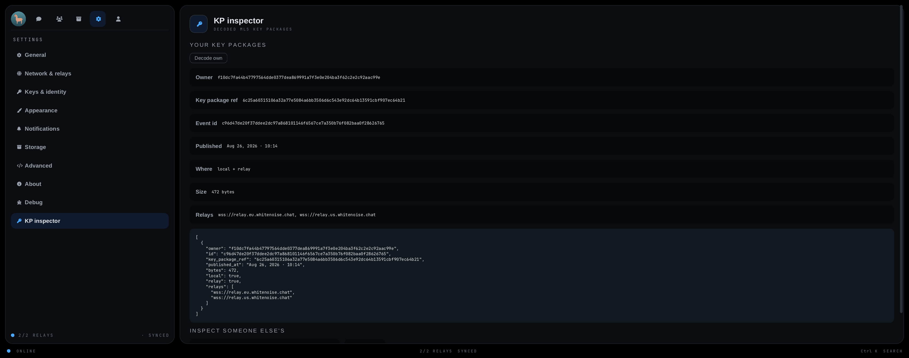

<p align="center">
  
</p>

<h1 align="center">White Noise Linux</h1>

<p align="center"><b>A native desktop client for end-to-end encrypted group chat over Nostr.</b></p>

<p align="center">
  <a href="https://github.com/marmot-protocol/whitenoise-linux/actions/workflows/ci.yml"></a>
  <a href="LICENSE"></a>
  
  
</p>

---

White Noise Linux is a desktop front end for [Marmot](https://github.com/marmot-protocol/mdk): [MLS](https://messaginglayersecurity.rocks/) group messaging carried over [Nostr](https://nostr.com) relays. You get the forward secrecy and post-compromise security of MLS together with a portable, self-owned Nostr identity: no phone number, no central server, no account anyone can take away from you. It is one Odin binary drawing an immediate-mode [clay](https://github.com/nicbarker/clay) layout on SDL3, and every secret lives in a single password-encrypted vault.

> **Status: early.** It works and is usable day-to-day, but it is moving fast, so expect rough edges.

**Jump to:** [Features](#features) · [Install](#install) · [Build from source](#build-from-source) · [Configuration](#configuration) · [Architecture](#architecture) · [Development](#development) · [Contributing](#contributing) · [License](#license)

## Features

**Messaging**

- One-to-one and group chats, end-to-end encrypted through Marmot's MLS, with sealed-sender invites over NIP-59.
- Markdown bodies (with typeset `$$` math blocks), reactions, replies, edits with history, forwarding, and search.
- A durable on-disk send queue, so messages written offline aren't lost and go out on reconnect.
- Per-chat unread tracking, surfaced as rail badges.

**Media**

- [Personal stickers and Nostr packs](docs/stickers.md), with pack previews from received stickers.
- Image albums, inline video (libmpv), voice messages, and a preview modal that reads PDFs (poppler), archives (libarchive), STL, OBJ, FBX, and GLB models, and source files with syntax highlighting.
- Direct JPG, PNG, GIF, and WebP links show inline cards with the image above its clickable URL. Link previews are on by default; turn them off in Settings > Advanced > Security & privacy to stop new automatic preview requests, including supported-site cards. Preview hosts can see your IP address. Attachment downloads are unaffected.
- PDFs have fullscreen controls on attachment tiles and in previews. The fullscreen modal fills the app window without changing desktop fullscreen. Pages fit the window and render at its pixel density, with previous/next controls. Exit fullscreen returns to the preview; Escape closes it.
- Attachments travel over Marmot's encrypted MIP-04 path. Profile pictures are the one deliberate exception: they go out publicly via Blossom.
- GLB attachments open as static 3D scenes with orbit, zoom, and the model inspector. The viewer reads node transforms, material factors, and embedded PNG/JPEG textures on UV0. GLB animation, skinning, morph targets, vertex colors, and Draco/meshopt compression are not supported. External resources are never fetched; translucent materials use alpha cutouts.

**Identity & accounts**

- Several accounts at once, each with a live Marmot worker receiving in the background.
- Contacts, private local-only per-contact nicknames, an archive, and npub QR codes.

**Look & feel**

- Eight themes (dark, light, AMOLED, retro, terminal, crayon, synthwave, chalkboard) and five accent colors, all data-driven from `themes/*.toml`. Drop your own pack in the data dir.
- English, Italian, German, and Japanese, switchable at runtime.
- Native desktop notifications, a command palette, and full keyboard navigation.

**Privacy & data**

- One password-encrypted vault holds every secret (see [Security model](#security-model)).
- Whole-folder encrypted backup and restore, sealed with your vault password.
- Opt-in OTLP metrics and audit logging, both off until you turn them on in Settings.

## Security model

There is no OS keyring and no plaintext key on disk. Every secret (your nsec, Marmot's per-account MLS keys, the decrypted media cache, the offline queue) lives in a single vault file (`vault.db`) sealed with XChaCha20-Poly1305 under a key derived from your password with Argon2id.

The flip side is that **there is no recovery**: lose the password and the data is gone. Take a backup if that matters to you; the backup is sealed with the same vault password, so a restore needs exactly one secret.

Image previews stay in memory for the session. They check decoded format
and dimensions, with a 16 MiB download limit and a 16-megapixel decode limit.
These checks do not sandbox image decoders or prevent requests to
private-network hosts. Disable link previews if you do not want message
links fetched automatically.

## Install

Every tagged release publishes a self-contained x86-64 AppImage on the [Releases](https://github.com/marmot-protocol/whitenoise-linux/releases) page. It carries its own libraries, fonts, and emoji set, so there is nothing to install alongside it:

```sh
chmod +x WhiteNoise-*-x86_64.AppImage
./WhiteNoise-*-x86_64.AppImage
```

Japanese text is the one exception: Noto Sans CJK is tens of megabytes, so it is not bundled and comes from your system instead (`noto-fonts-cjk` on Arch, `fonts-noto-cjk` on Debian and Ubuntu).

Each release also ships a Flatpak bundle on the GNOME 50 runtime:

```sh
flatpak install --user WhiteNoise-*-x86_64.flatpak
flatpak run dev.ipf.whitenoise
```

The Flatpak keeps its data under `~/.var/app/dev.ipf.whitenoise/`. One thing stays outside its sandbox: "Launch at login".

Linux ARM64 and Windows x86-64 archives are built on Linux alongside the
existing Linux x86-64 packages. macOS Intel and ARM64 archives are published
when the release operator has configured the private Apple SDK described
below.

| Target | Archive | Launch |
| --- | --- | --- |
| Linux ARM64 | `WhiteNoise-<version>-linux-arm64.tar.gz` | Extract and run the top-level `whitenoise` script; requires glibc 2.39 or newer |
| Windows x86-64 | `WhiteNoise-win-Setup.exe` or `WhiteNoise-win-Portable.zip` | Run the installer, or extract the portable zip anywhere and run `White Noise.exe`; requires Windows 10 or newer |
| macOS Intel / ARM64 | `WhiteNoise-<version>-darwin-{amd64,arm64}.tar.gz` | Extract `White Noise.app`; requires macOS 13 or newer |

Windows installs update themselves through [Velopack](https://velopack.io).
The app checks this repository's GitHub releases at launch and every six
hours, downloads a newer build in the background, and shows a
"Restart now" strip in the status bar. An update left waiting applies on the
next launch. The About page in Settings shows the update state and has a "Check now"
button. The portable zip updates the same way, in place. A build run from
anywhere else (a development build, a staging zip) has no updater and shows
no update UI.

Windows and macOS builds do not run webxdc (`.xdc`) apps. Linux retains its
WebKitGTK webxdc viewer. Ordinary attachments, video, PDFs, 3D previews,
speech and dictation are not disabled on the other targets.

The macOS bundle is ad-hoc signed on Linux, not Developer ID signed or
notarized. Gatekeeper may block a downloaded copy; distributing a trusted
macOS release also requires the operator's Apple signing and notarization
credentials. Linux CI checks Mach-O dependencies and signs the bundle, but
cannot run it. A macOS runtime check is still required before treating that
artifact as tested.

On Arch, `packaging/arch/PKGBUILD` builds a `whitenoise-linux-git` package against the system SDL3, mpv, and poppler:

```sh
cd packaging/arch && makepkg -si
```

### Versioning

`APP_VERSION` in `app/advanced.odin` is `YYYY.M.D+REVISION`, starting at
`2026.9.15+1`. Like Android and iOS, the date is the release date and the
numeric revision increases for every shipment, including on a new date.
Set it before releasing and tag that commit `vYYYY.M.D-build.REVISION`
(for example, `v2026.9.15-build.1`). Never reuse a published tag.
About, diagnostics, AppImage, Flatpak, and Arch packaging use this version.

## Build from source

You need `just`, the [Odin compiler](https://odin-lang.org/docs/install/), a C and C++ compiler, CMake, and a Rust toolchain (Marmot's C bundle is built from source). Plus SDL3 and the media libraries the viewers bind.

**Debian / Ubuntu** (SDL3 needs 25.04 or newer, or a source build):

```sh
sudo apt-get install -y just pkg-config cmake clang git curl \
  libsdl3-dev libarchive-dev libmpv-dev libpoppler-glib-dev libcairo2-dev libglib2.0-dev \
  libcurl4-openssl-dev libssl-dev libfreetype-dev libwebp-dev \
  libavformat-dev libavcodec-dev libavutil-dev libswresample-dev
```

**Arch:**

```sh
sudo pacman -S --needed just odin rust cmake sdl3 libarchive mpv ffmpeg poppler-glib cairo glib2 curl openssl freetype2 libwebp
```

**Then:**

```sh
git clone https://github.com/marmot-protocol/whitenoise-linux
cd whitenoise-linux
just build
just run
```

The first build is the slow one: it clones the pinned Marmot revision and builds its C bundle, fetches clay, ufbx, MicroTeX and the Twemoji set, and (on an Odin install shipping no prebuilt `vendor/stb` archives) builds those. Everything after that is a plain Odin compile of a few seconds.

### Cross releases from Linux

`scripts/cross-build.sh TARGET` accepts `linux-arm64`, `windows-amd64`,
`darwin-amd64`, or `darwin-arm64`. `WN_TARGET=TARGET scripts/build.sh` invokes
the same path. The normal `scripts/build.sh` remains a native Linux build.
Each target has separate objects, Rust output, libraries and package files
under `build/cross/TARGET`; finished archives go to `dist/`.

The supplied amd64 Linux container includes the cross compilers and package
tools:

```sh
podman build -f packaging/cross/Containerfile -t whitenoise-cross packaging/cross
podman run --rm -v "$PWD:/work" whitenoise-cross linux-arm64
podman run --rm -v "$PWD:/work" whitenoise-cross windows-amd64
```

The ARM64 build extracts an Ubuntu 24.04 target sysroot without running ARM
compilers. Windows uses LLVM-MinGW 20260922 with UCRT and libc++, paired with
Rust's `x86_64-pc-windows-gnullvm` target. Its separate vcpkg triplet avoids
reusing GCC/MSVCRT libraries. Windows 10 or newer supplies UCRT. Both Apple
targets use osxcross. Odin emits target objects; the target C++ linker links
them with Marmot, Clay, STB,
MicroTeX, the app shims and media libraries. Source revisions are pinned in
`DEPS_PIN`, and Windows/macOS dependency recipes are pinned by the vcpkg
baseline in `packaging/cross/vcpkg.json`. FFmpeg includes dav1d for CPU AV1
decoding on Windows and macOS. Speech uses the same pinned upstream
sherpa-onnx CPU runtime as the native build. Packages include the speech/font
helpers, curl, their loader dependencies, fonts, emoji data and licenses.

For macOS, supply an SDK extracted from an Apple download you are entitled
to use. Keep it private. No public SDK mirror is used by these scripts.
The archive must use osxcross's `MacOSX<version>.sdk.tar.xz` or
`.tar.gz` naming and contain that SDK directory:

```sh
export MACOS_SDK_SHA256='<sha256 of your SDK archive>'
podman run --rm -v "$PWD:/work" -v "/private/sdk-directory:/run/macos-sdk:ro" \
  -e MACOS_SDK_ARCHIVE=/run/macos-sdk/MacOSX14.5.sdk.tar.xz \
  -e MACOS_SDK_SHA256 whitenoise-cross darwin-arm64
# Use darwin-amd64 for an Intel bundle.
```

In GitHub Actions, set repository variable `WN_ENABLE_MACOS=true`,
`MACOS_SDK_FILENAME` to the archive basename, and secrets `MACOS_SDK_URL`
(an operator-managed private HTTPS download URL) and `MACOS_SDK_SHA256`.
The URL must work without an interactive login, for example a short-lived
signed artifact URL. The job fails if an enabled SDK is missing or fails its
checksum. Without the opt-in variable, macOS jobs are explicitly skipped and
Linux/Windows jobs still run. The SDK is mounted read-only into the build
container and is never part of the uploaded release archive.

`.github/workflows/cross.yml` is called by CI and tagged releases. Its Linux
ARM64 and Windows jobs extract the shipped archive and require a headless
launch to produce a screenshot under QEMU or Wine. No compiler runs under
those emulators. The macOS jobs report their runtime-verification limit
instead of claiming a launch succeeded.

Tagged releases publish the Windows installer, the portable zip, and
Velopack's feed (`releases.win.json`, `assets.win.json`, `RELEASES`, and the
`.nupkg` packages) to the GitHub release. The job first downloads the previous
release so Velopack can also publish a delta package. Windows binaries,
`Update.exe`, and `Setup.exe` are Authenticode-signed with
[jsign](https://ebourg.github.io/jsign/), and a tag fails without signing
configured. Set repository variables `JSIGN_STORETYPE` (jsign's
`--storetype`, for example `PKCS12` or `TRUSTEDSIGNING`) and `JSIGN_ALIAS`,
secret `JSIGN_STOREPASS`, and either secret `JSIGN_KEYSTORE_BASE64` (a
base64 keystore file, such as a `.p12`) or secret `JSIGN_KEYSTORE` (a cloud
keystore name or endpoint). Local builds sign when the same `JSIGN_*`
variables are passed to the container. Staging builds (a non-release version)
keep a plain zip and never join the update feed.

ngit staging uses `.ngit/act/workflows/release-cross.yml` alongside the
existing x86-64 AppImage workflow. The act worker needs Podman with working
user namespaces and permission to build and run nested containers. Configure
the same SDK variables/secrets there to enable macOS. Each target is passed
to `actions/upload-artifact`; Blossom publication requires the coordinator's
`--blossom-servers` setting and an artifact-size limit large enough for the
archives (`--blossom-max-artifact-bytes`, commonly above the default 64 MiB).


### First run

The first time you launch, you either paste an existing nsec or generate a new one, and you set a vault password. That creates the vault; from then on you just enter the password to open it. A wrong password fails the cipher's authentication tag, so there's no recovery path, but the unlock screen has a **Use another key** option that wipes the vault and starts over from a fresh nsec.

## Configuration

The data directory is the app's first argument and defaults to `~/.local/share/whitenoise`. It holds the vault, the media cache, the offline queue, and any custom theme packs you drop in its `themes/` subdirectory. UI preferences (theme, accent, locale, notification toggles, nicknames) live separately in `$XDG_CONFIG_HOME/whitenoise/settings.json`.

Telemetry and audit-log endpoints are configured in `observability.toml`, but nothing is ever sent until you enable the toggles under **Settings**, in the **Advanced** section.

A few environment variables matter, mostly for automation:

| Variable | Effect |
| --- | --- |
| `WN_VAULT_PW` | Unlocks (or creates) the vault without showing the gate. |
| `WN_SHOT` / `WN_SHOT_FRAME` | Capture a screenshot after N frames, then exit. |
| `WN_TEST_*` | Drive the app into a given pane or action on boot; see `app/main.odin`. |

### Deep links (`marmot://`)

Profile QR codes encode `marmot://profile/<npub>?from=qr`, the scheme shared by all Marmot clients. The app handles these when they arrive as a command-line argument or are pasted into **Add contact**. To have your desktop hand `marmot://` links to White Noise:

```sh
scripts/install-scheme.sh
```

## Architecture

```
 SDL3  ←──  app/sdlrl/  ←──  app/renderer.odin  ←──  clay layout (app/*.odin)
                                                          │
                                                    app/state.odin  (Ui_State)
                                                          │
                                              app/workers.odin  (worker threads)
                                                          │
                                                   marmot/marmot.odin
                                                          │
                                            marmot-c  →  the Marmot runtime
```

It reads flat by intent. The layout is immediate-mode: every frame rebuilds the clay tree by reading one `Ui_State` struct, so there is no retained view tree, no widget objects, and no observer graph to trace. Panes are plain procs.

| Path | What's there |
| --- | --- |
| `app/` | The whole app: panes, layout, state, workers, vault, media viewers |
| `app/state.odin` | `Ui_State`, the single struct every pane reads, plus the live theme globals |
| `app/workers.odin` | The live-subscription worker and the per-send threads that keep blocking Marmot calls off the UI thread |
| `app/sdlrl/` | SDL3 shim with a raylib-shaped API: window, input, IME, clipboard, and a stb_truetype text engine |
| `app/vault.odin` | The password-encrypted secret vault |
| `marmot/` | The `marmot-c` bindings, the only place that touches C |
| `tests/smoke/` | Standalone liveness check for the bindings against a fresh home dir |
| `themes/` | The theme packs, `#load`ed at build time |
| `lang/` | gettext catalogs (`en` source, plus `it`, `de`, `ja`), `#load`ed at build time |
| `assets/` | Logo, fonts, and the SVG starter-avatar set |

A few design choices are worth knowing before you dig in:

- **Optimistic rendering.** Sending, reacting, and unreacting apply locally and repaint immediately, then reconcile against Marmot's response. The UI never blocks on the network round-trip.
- **Two upload paths.** Chat attachments go through Marmot's encrypted MIP-04 path, readable only by group members. Profile pictures take the deliberately public Blossom path.
- **Data-driven themes.** Every color, metric, and capability flag comes from a `themes/*.toml` pack. A new component reads the globals; it never branches on which theme is active.

For the deeper details, see [`AGENTS.md`](AGENTS.md).

## Development

```sh
just                   # list commands
just build             # build
just test              # build, then run the tests
just dev               # rebuild code in-process, keeping the window
just test-reload       # check reload, unlock, and failed-build recovery
just translations      # regenerate the gettext catalogs
```

`just dev [data-dir]` and `just run [data-dir]` accept an optional data directory.
The shell implementations live under `scripts/`; CI and packaging call them directly.

All tests live under `tests/`; `just test` runs the same checks as CI. For a focused Odin run, use `tests/odin.sh app [odin test flags]` or `tests/odin.sh app/sdlrl`. The runner assembles a temporary package so tests retain access to private symbols. End-to-end testing (a QEMU VM harness, a headless control daemon, and multi-VM messaging scenarios) lives in the separate [`darkmatter-automated-testing`](https://github.com/marmot-protocol/darkmatter-automated-testing) repo, which builds this checkout.

`just dev` keeps the SDL window and vault unlock across code reloads. It rebuilds
the UI and runtime from saved settings and drafts, so transient dialogs and
playback reset. Reload waits for active writes and file pickers, and for you
to send or clear staged attachments and finish message edits.
Failed builds leave the current app running. Changes to the small C window
host or the Rust library restart the host; the vault stays unlocked for the
`just dev` session. Normal release builds do not accept the dev unlock cache.

To build against a different Marmot revision, edit `mdk-commit` in `DEPS_PIN`; the next `just build` re-checks it out and rebuilds the C bundle. Every pinned third-party revision lives in that one file.

## Contributing

Issues and pull requests are welcome. If you're working with an AI coding agent, point it at [`AGENTS.md`](AGENTS.md) first; it has the architecture and conventions in more detail than this file.

Before your first commit, install the project git hooks (**required**):

```sh
scripts/install-hooks.sh
```

This points `core.hooksPath` at the tracked `.githooks/` directory and registers the `po-clean` catalog filter, so the same checks CI enforces run locally before you commit. The `pre-commit` hook normalizes and validates staged gettext catalogs (stripping source-line references and the volatile `POT-Creation-Date` header so unrelated line shifts never surface as diffs), and keeps the GitHub mirror of the ngit-ci gate in sync. Needs `gettext`.

In a real emergency you can bypass a single commit with `git commit --no-verify`, but CI runs the same checks, so the bypass only defers them.

## License

Licensed under the GNU Affero General Public License, version 3 (AGPL-3.0); see [`LICENSE`](LICENSE) for the full text. In short: you're free to use, modify, and redistribute it, but if you run a modified version as a network service you have to offer your users its source.
