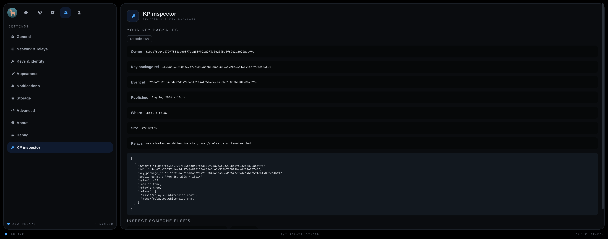

<p align="center">
  
</p>

<h1 align="center">White Noise Linux</h1>

<p align="center"><b>A native desktop client for end-to-end encrypted group chat over Nostr.</b></p>

<p align="center">
  <a href="https://github.com/marmot-protocol/whitenoise-linux/actions/workflows/ci.yml"></a>
  <a href="LICENSE"></a>
  
  
</p>

---

White Noise Linux is a desktop front end for [Marmot](https://github.com/marmot-protocol/mdk): [MLS](https://messaginglayersecurity.rocks/) group messaging carried over [Nostr](https://nostr.com) relays. You get the forward secrecy and post-compromise security of MLS together with a portable, self-owned Nostr identity: no phone number, no central server, no account anyone can take away from you. It is one Odin binary drawing an immediate-mode [clay](https://github.com/nicbarker/clay) layout on SDL3, and every secret lives in a single password-encrypted vault.

> **Status: early.** It works and is usable day-to-day, but it is moving fast, so expect rough edges.

**Jump to:** [Features](#features) · [Install](#install) · [Build from source](#build-from-source) · [Configuration](#configuration) · [Architecture](#architecture) · [Development](#development) · [Contributing](#contributing) · [License](#license)

## Features

**Messaging**

- One-to-one and group chats, end-to-end encrypted through Marmot's MLS, with sealed-sender invites over NIP-59.
- Markdown bodies (with typeset `$$` math blocks), reactions, replies, edits with history, forwarding, and search.
- Export the loaded chat window as HTML or Markdown from the members panel. HTML prepares embedded images in the background and shows image progress before opening the save dialog. Unavailable images appear as notes in the transcript. Leaving the chat or changing accounts discards an unfinished export.
- Emoji search accepts names and shortcodes, such as `100` for hundred points and `thumbsup` for thumbs up. Shortcodes work with or without surrounding colons.
- Custom `:shortcode:` emoji use NIP-30. The image goes out as an encrypted attachment, and the message carries an `["emoji", shortcode, url]` tag pointing at that attachment's Blossom URL. Reactions work the same way: a `:shortcode:` reaction carries its own `imeta` and emoji tag. Forwards keep the tags. `patches/mdk-tagged-media.patch` adds `marmot_send_tagged_media` and `marmot_react_with_media`, and keeps the media key for reaction images the way it does for chat media.
- A durable on-disk send queue, so messages written offline aren't lost and go out on reconnect.
- Forwarded attachments download and prepare in the background. A status strip names the destination and stays visible through preparation and sending, even if you switch chats. Failed forwards can be retried from the destination chat.
- Per-chat unread tracking, surfaced as rail badges.
- Deleting a chat folder requires confirmation, from both Settings and its context menu. Only the folder is removed; its chats stay in your chat list.
- Folder rules file chats automatically: name includes a word, has a member (npub), has fewer or more than N people (you included), or has unread messages. Each folder matches all of its rules or any one of them. A chat goes to the first folder, in folder order, whose rules match. A chat you move by hand stays in that folder; choosing "Follow folder rules" in the move dialog hands it back to the rules. Member rules read each group's member list on every chat-list refresh, and only while such a rule exists.

**Media**

- [Personal stickers and Nostr packs](docs/stickers.md), with pack previews from received stickers.
- Image albums, inline video (libmpv), voice messages, and a preview modal that reads PDFs (poppler), archives (libarchive), STL, OBJ, FBX, and GLB models, and source files with syntax highlighting.
- Direct JPG, PNG, GIF, and WebP links show inline cards with the image above its clickable URL. Link previews are on by default; turn them off in Settings > Advanced > Security & privacy to stop new automatic preview requests, including supported-site cards. Preview hosts can see your IP address. Attachment downloads are unaffected.
- PDFs have fullscreen controls on attachment tiles and in previews. The fullscreen modal fills the app window without changing desktop fullscreen. Pages fit the window and render at its pixel density, with previous/next controls. Exit fullscreen returns to the preview; Escape closes it.
- Attachments travel over Marmot's encrypted MIP-04 path. Profile pictures are the one deliberate exception: they go out publicly via Blossom.
- GLB attachments open as static 3D scenes with orbit, zoom, and the model inspector. The viewer reads node transforms, material factors, and embedded PNG/JPEG textures on UV0. GLB animation, skinning, morph targets, vertex colors, and Draco/meshopt compression are not supported. External resources are never fetched; translucent materials use alpha cutouts.

**Identity & accounts**

- Several accounts at once, each with a live Marmot worker receiving in the background.
- Contacts, private local-only per-contact nicknames, an archive, and npub QR codes.

**Look & feel**

- Eight themes (dark, light, AMOLED, retro, terminal, crayon, synthwave, chalkboard) and five accent colors, all data-driven from `themes/*.toml`. Drop your own pack in the data dir.
- English, Italian, German, and Japanese, switchable at runtime, including search dialogs, theme notifications, and confirmation errors.
- Native desktop notifications, a command palette, and full keyboard navigation.
- Chat transitions follow the conversation, not its position in the list. New messages can reorder the list without sliding the open chat.
- Reduce motion hides animated synth, dust, scan, and wave backdrops, including the vault gate's synth backdrop. Static decorations remain visible.

**Privacy & data**

- One password-encrypted vault holds every secret (see [Security model](#security-model)).
- Whole-folder encrypted backup and restore, sealed with your vault password.
- Opt-in OTLP metrics and audit logging, both off until you turn them on in Settings.

## Security model

There is no OS keyring and no plaintext key on disk. Every secret (your nsec, Marmot's per-account MLS keys, the decrypted media cache, the offline queue) lives in a single vault file (`vault.db`) sealed with XChaCha20-Poly1305 under a key derived from your password with Argon2id.

The flip side is that **there is no recovery**: lose the password and the data is gone. Take a backup if that matters to you; the backup is sealed with the same vault password, so a restore needs exactly one secret.

Creating or changing a vault password requires at least 40 bits of estimated
strength. The Odin check counts character diversity and discounts repeated
blocks and alphabet or keyboard sequences. It rejects whole passwords found
in the [SecLists common-password file](https://github.com/danielmiessler/SecLists/blob/master/Passwords/Common-Credentials/10k-most-common.txt),
including case changes and simple letter substitutions. It does not penalize
individual words inside a passphrase or require particular character classes.
Use unrelated words or a password-manager password.

The corpus is staged at `vendor/common-passwords.txt`, pinned by `seclists-commit`
in `DEPS_PIN`, and embedded in the app. The check runs offline.

This heuristic does not measure entropy, model a full dictionary attack, or
predict cracking time. It scores the first 100 Unicode characters to bound
its work; the full password encrypts the vault. Existing passwords still unlock
regardless of strength. The `WN_VAULT_PW` harness bypasses this UI policy.

Image previews stay in memory for the session. They check decoded format
and dimensions, with a 16 MiB download limit and a 16-megapixel decode limit.
These checks do not sandbox image decoders or prevent requests to
private-network hosts. Disable link previews if you do not want message
links fetched automatically.

## Install

Every tagged release publishes a self-contained x86-64 AppImage on the [Releases](https://github.com/marmot-protocol/whitenoise-linux/releases) page. It carries its own libraries, fonts, and emoji set, so there is nothing to install alongside it:

```sh
chmod +x WhiteNoise-*-x86_64.AppImage
./WhiteNoise-*-x86_64.AppImage
```

Japanese text is the one exception: Noto Sans CJK is tens of megabytes, so it is not bundled and comes from your system instead (`noto-fonts-cjk` on Arch, `fonts-noto-cjk` on Debian and Ubuntu).

Each release also ships a Flatpak bundle on the GNOME 50 runtime:

```sh
flatpak install --user WhiteNoise-*-x86_64.flatpak
flatpak run dev.ipf.whitenoise
```

The Flatpak keeps its data under `~/.var/app/dev.ipf.whitenoise/`. One thing stays outside its sandbox: "Launch at login".

Linux ARM64 and x86-64 tarballs and Windows x86-64 packages are built on
Linux alongside the AppImage and Flatpak; macOS Intel and ARM64 bundles are
built on a Mac, and the OpenBSD package on OpenBSD 7.9.

| Target | Archive | Launch |
| --- | --- | --- |
| Linux ARM64 / x86-64 | `WhiteNoise-<version>-linux-{arm64,amd64}.tar.gz` | Extract and run the top-level `whitenoise` script; requires glibc 2.39 or newer |
| Windows x86-64 | `WhiteNoise-win-Setup.exe` or `WhiteNoise-win-Portable.zip` | Run the installer, or extract the portable zip anywhere and run `White Noise.exe`; requires Windows 10 or newer |
| macOS Intel / ARM64 | `WhiteNoise-<version>-darwin-{amd64,arm64}.tar.gz` | Extract `White Noise.app`; requires macOS 13 or newer |
| OpenBSD amd64 | `WhiteNoise-<version>-openbsd-amd64.tar.gz` | Install as root under a protected prefix, then run as your normal user (see below). Requires OpenBSD 7.9 and `pkg_add libarchive libwebp mpv poppler cairo curl glib2 zenity libnotify`. Reading aloud and dictation are not included |

Windows installs update themselves through [Velopack](https://velopack.io).
The app checks this repository's GitHub releases at launch and every six
hours, downloads a newer build in the background, and shows a
"Restart now" strip in the status bar. An update left waiting applies on the
next launch. The About page in Settings shows the update state and has a "Check now"
button. The portable zip updates the same way, in place. A build run from
anywhere else (a development build, a staging zip) has no updater and shows
no update UI.

Windows and macOS builds do not run webxdc (`.xdc`) apps. Linux retains its
WebKitGTK webxdc viewer. Ordinary attachments, video, PDFs, 3D previews,
speech and dictation are not disabled on the other targets.

The macOS bundle is ad-hoc signed, not Developer ID signed or notarized, so
macOS says it cannot verify the developer the first time you open it. Open it
once with Control-click, Open (or System Settings, Privacy & Security, Open
Anyway); after that it launches normally. A Developer ID signature and
notarization need an Apple Developer account.

On Arch, `packaging/arch/PKGBUILD` builds a `whitenoise-linux-git` package against the system SDL3, mpv, and poppler:

```sh
cd packaging/arch && makepkg -si
```

### Versioning

`APP_VERSION` in `app/advanced.odin` is `YYYY.M.D+REVISION`, starting at
`2026.9.15+1`. Like Android and iOS, the date is the release date and the
numeric revision increases for every shipment, including on a new date.
Set it before releasing and tag that commit `vYYYY.M.D-build.REVISION`
(for example, `v2026.9.15-build.1`). Never reuse a published tag.
About, diagnostics, AppImage, Flatpak, and Arch packaging use this version.

## Build from source

You need `just`, the [Odin compiler](https://odin-lang.org/docs/install/), a C and C++ compiler, CMake, and a Rust toolchain (Marmot's C bundle is built from source). Plus SDL3 and the media libraries the viewers bind.

**Debian / Ubuntu** (SDL3 needs 25.04 or newer, or a source build):

```sh
sudo apt-get install -y just pkg-config cmake clang git curl \
  libsdl3-dev libarchive-dev libmpv-dev libpoppler-glib-dev libcairo2-dev libglib2.0-dev \
  libcurl4-openssl-dev libssl-dev libfreetype-dev libwebp-dev \
  libavformat-dev libavcodec-dev libavutil-dev libswresample-dev librsvg2-bin
```

**Arch:**

```sh
sudo pacman -S --needed just odin rust cmake sdl3 libarchive mpv ffmpeg poppler-glib cairo glib2 curl openssl freetype2 libwebp librsvg
```

**Then:**

```sh
git clone https://github.com/marmot-protocol/whitenoise-linux
cd whitenoise-linux
just build
just run
```

The first build is the slow one: it clones the pinned Marmot revision and builds its C bundle, fetches clay, ufbx, MicroTeX and the Noto, Twemoji and OpenMoji emoji sets (rasterizing the latter two from SVG with `rsvg-convert`), and (on an Odin install shipping no prebuilt `vendor/stb` archives) builds those. Everything after that is a plain Odin compile of a few seconds.

The native Linux build extracts speech, font, and emoji archives without
restoring ownership, so it can run as root inside Flatpak's restricted user
namespace.

The build also packs each emoji set's catalog PNGs into `emoji/<set>.bin`.
The app reads the active set's fixed-size RGBA data at startup (and again
when you pick another set in Appearance) and uploads only visible picker
rows, so opening, scrolling, and searching do not launch PNG decoders for
catalog emoji. Each pack is about 38 MiB uncompressed (OpenMoji's 49 MiB,
with its own extra emoji), so the three add about 127 MiB of resources;
only the active one is resident. They ship beside `emoji-catalog.tsv` in
every package.

The release workflow also builds Flatpak on `master` to populate caches that
later tags can restore. It caches the GNOME 50 module outputs, downloads,
Git mirrors, and ccache, plus separate Marmot and C dependency outputs.
Marmot requires an exact pin-and-patch match; MicroTeX and ufbx use the same
build stamps as native CI. Cargo target directories are not cached, and
Flatpak objects are kept separate from native Ubuntu objects. Only tag
builds publish releases.

### Cross releases

`scripts/cross-build.sh TARGET` accepts `linux-arm64`, `linux-amd64`,
`windows-amd64`, `darwin-amd64`, or `darwin-arm64`. `linux-amd64` is not a
cross build, but the same portable tarball recipe as `linux-arm64`.
`WN_TARGET=TARGET scripts/build.sh` invokes
the same path. The normal `scripts/build.sh` remains a native Linux build.
Each target has separate objects, Rust output, libraries and package files
under `build/cross/TARGET`; finished archives go to `dist/`.
Both native and cross builds include the Nostr and Namecoin WebSocket
transports (`ws_shim.c` and `nc_shim.c`) in `libwnws.a`.

The supplied amd64 Linux container includes the cross compilers and package
tools:

```sh
podman build -f packaging/cross/Containerfile -t whitenoise-cross packaging/cross
podman run --rm -v "$PWD:/work" whitenoise-cross linux-arm64    # or linux-amd64
podman run --rm -v "$PWD:/work" whitenoise-cross windows-amd64
```

The ARM64 build extracts an Ubuntu 24.04 target sysroot without running ARM
compilers. Windows uses LLVM-MinGW 20260922 with UCRT and libc++, paired with
Rust's `x86_64-pc-windows-gnullvm` target. Its separate vcpkg triplet avoids
reusing GCC/MSVCRT libraries. Windows 10 or newer supplies UCRT. Odin emits
target objects; the target C linker links the app with Marmot, Clay, STB,
the app shims and media libraries. The C++ linker links `wn-math` with
MicroTeX and Cairo. Source revisions are pinned in
`DEPS_PIN`, and Windows/macOS dependency recipes are pinned by the vcpkg
baseline in `packaging/cross/vcpkg.json`. FFmpeg includes dav1d for CPU AV1
decoding on Windows and macOS. Speech uses the same pinned upstream
sherpa-onnx CPU runtime as the native build. Packages include the speech/font
helpers, curl, their loader dependencies, fonts, emoji data and licenses.
The GUST font license is checked in at `assets/fonts/GUST-FONT-LICENSE.txt`
and staged locally by native and cross builds, without contacting CTAN mirrors.

macOS bundles build on a Mac, where Apple's SDK is licensed: Xcode or its
Command Line Tools supply it, and no Apple account is needed. An Apple silicon
Mac builds both architectures. `scripts/macos-setup.sh` installs the pinned
tools with Homebrew (GNU userland, bash 5, Odin, Bun, Meson) the way the
container does on Linux, and needs Homebrew, rustup and the Command Line
Tools already present:

```sh
scripts/macos-setup.sh ~/.cache/whitenoise-macos-tools
source ~/.cache/whitenoise-macos-tools/env
scripts/cross-build.sh darwin-arm64    # or darwin-amd64 for Intel
```

The build uses Xcode's clang with a pinned `-arch` and a macOS 13 deployment
target, then signs every Mach-O file and the bundle ad hoc with `codesign`.

OpenBSD builds natively on OpenBSD 7.9; there is no cross toolchain for it.
`scripts/openbsd-build.sh` lists the packages to install in its header, builds
the pinned Odin release from source (OpenBSD has no Odin package), runs
`scripts/build.sh`, and packs the install tree as
`dist/WhiteNoise-<version>-openbsd-amd64.tar.gz`:

```sh
doas pkg_add bash git cmake ninja gmake coreutils llvm%21 rust unzip-- \
  sdl3 libarchive libwebp mpv poppler cairo curl glib2 ffmpeg zenity libnotify librsvg
bash scripts/openbsd-build.sh
```

Run the build as your normal user, with `sudo` or `doas` configured for
package staging. The script tests a root-owned installation, including an
Xvfb window that resizes and closes under confinement.

OpenBSD's Rust package (1.94) is older than the toolchain Marmot pins, so
`scripts/build.sh` enables the one unstable feature the build needs
(`cfg_select`) on OpenBSD. It also raises the per-process data size limit,
which rustc and Odin's optimizing build otherwise run out of.
Reading aloud and dictation are left out: sherpa-onnx publishes no OpenBSD
runtime, so those features report that they could not start.
Webxdc is disabled on OpenBSD. `.xdc` attachments remain ordinary downloadable
files; the build omits `wn-webview`, and installation removes an older copy.

OpenBSD requires a root-owned installation whose resources, helpers,
libraries and ancestor directories are not group- or other-writable.
Mutable symlink routes are rejected too. Extract the release as root into
a protected directory, not your home directory:

```sh
doas tar -xzf WhiteNoise-<version>-openbsd-amd64.tar.gz -C /usr/local
/usr/local/WhiteNoise-<version>-openbsd-amd64/bin/whitenoise
```

Run the app as your normal user. Running as root or directly from an
unprivileged build tree is rejected. For a source build, use
`doas bash scripts/install-tree.sh /usr/local/whitenoise whitenoise`, then
run `/usr/local/whitenoise/bin/whitenoise`.

The main process locks `unveil()` and enters `pledge()` after opening the
display, before starting attachment workers, the vault or Marmot. It keeps
networking, display/audio access and read-write access to the canonical
Marmot data, app settings and Downloads directories. Runtime resources are
read-only. Temporary files and caches stay under the data directory.
The MDK filesystem patch anchors directory creation inside the unveiled data
tree; it does not require opening `/`.

SQLCipher's C build uses OpenBSD's concealed allocators instead of unsupported
`mlock` calls. Those allocations are excluded from core dumps and wiped on
free. They can enter swap; swap confidentiality depends on the host's
encryption policy. Marmot's bundled OpenSSL symbols are hidden from dynamic
libraries so they cannot replace system libcurl's incompatible LibreSSL symbols.

The main process has no `exec` promise. A prestarted broker launches only
the frozen `wn-*` helper paths, with fixed decoder arguments and an empty
decoder environment. A separate broker runs curl, notifications and file
dialogs with an inherited, locked policy. Display credentials are copied
into a private runtime home, removed with its GTK state on normal shutdown.
Forced termination can leave that private directory behind.

SDL is built from its pin without SysV shared memory and linked statically.
GTK dialogs use Cairo rather than GL for the same restriction. Links offer
Copy link, storage offers Copy path instead of Open folder, and Launch at
login is not offered. Network and desktop IPC remain available; this policy
does not isolate X11 or D-Bus from the rest of your desktop.

Websocket fetching remains in-process. Frame lengths are checked against the
remaining response capacity without adding untrusted lengths, including across
fragmented messages.

The `wn-font` helper receives an already-open input file on stdin, locks
`unveil()` with no paths and pledges `stdio` before initializing FreeType.

Still images are decoded by `wn-image`, including header probes for card,
sticker and model-texture budgets. The app sends compressed bytes over private
pipes and accepts only bounded RGBA pixels. Each request allows at most
128 MiB of input, 256 MiB of pixels and 32,768 pixels per dimension; individual
callers can impose smaller limits. The parent checks the response dimensions,
byte count, end of stream and exit status, and kills the helper after ten
seconds. A missing helper or failed decode has no in-process fallback.

Archives are listed and extracted by `wn-archive`. Requests accept up to
128 MiB of input, scan at most 65,536 headers and return at most 2,000 regular
files. Listings are limited to 8 MiB, with UTF-8 names up to 4,096 bytes;
one extracted entry is limited to 64 MiB. The parent validates every metadata
record before publishing it. Neither side writes extracted files to disk.
Links and libarchive filters requiring external programs are rejected.

PDF pages are rendered by `wn-pdf`. The app retains source bytes and requests
one page at a time, including on navigation and fullscreen resize. Input is
limited to 128 MiB and documents to 10,000 pages; each reply contains at most
64 MiB of RGBA pixels, with dimensions no larger than 32,768 or the requested
bounding box. Poppler and embedded-font parsing stay in the helper.

STL, OBJ, GLB and G-code parsing runs in `wn-mesh`; FBX parsing and animation
evaluation run in `wn-fbx`. Input is limited to 128 MiB, geometry to two
million triangles or toolpath segments, and flat replies to 512 MiB. The app
validates channel sizes, indices, finite values, strings and texture references
before publishing a model. Embedded GLB images go through `wn-image`.
Neither cgltf nor ufbx is linked into the main application.
FBX triangles are not subdivided after import; animation poses the imported
geometry without changing its topology.

Math blocks are rendered by `wn-math`; MicroTeX is no longer linked into the
main application. Each request accepts at most 4,096 source bytes and returns
at most 8 MiB of straight RGBA pixels, with dimensions no larger than 4,096.
The helper embeds its font. Invalid input, a failed helper or an exceeded
budget leaves the source text visible instead of rendering it in-process.

On OpenBSD, `wn-image`, `wn-archive`, `wn-mesh`, `wn-fbx` and `wn-math` lock
`unveil()` with no filesystem paths and pledge `stdio` before reading input.
`wn-math` loads its fixed UTF-8 locale before confinement; parsing never
opens locale files.
`wn-pdf` initializes Fontconfig and the trusted bundled fonts first, then
unveils the bundle, standard system font trees and Poppler resource directories
read-only. Directory grants avoid OpenBSD's limit on individual unveiled names.
It locks that policy and pledges `stdio rpath` before reading PDF bytes.

The image, archive, PDF, mesh, FBX and math decoders share a 1 GiB memory limit,
no inherited environment and only input, output and a null error stream.
Image, archive, PDF, mesh and math helpers
have five CPU seconds and ten seconds wall time; the parent requires exact
reply framing, end of stream and successful exit. FBX helpers have a ten-second
deadline and an echoed sequence number per exchange, but no cumulative CPU
quota, so valid looping animations do not expire.
Static FBX helpers close after loading; animated helpers close with the model.
An invalid pose leaves the last validated geometry intact and closes the helper.

Failure has no in-process fallback. Linux requires `close_range` (kernel 5.9
or newer); descriptor or sandbox setup failure stops decoding. Platforms other
than OpenBSD use separate resource-limited processes, not an equivalent
filesystem or syscall sandbox. Video parsing remains in the main process.

`.github/workflows/cross.yml` is called by CI and tagged releases. Its Linux
ARM64 and Windows jobs extract the shipped archive and require a headless
launch to produce a screenshot under QEMU or Wine. No compiler runs under
those emulators. Its macOS jobs build both bundles on a GitHub Apple silicon
runner and launch each one there, the Intel bundle through Rosetta. Its
OpenBSD job boots the OpenBSD 7.9 image from
[cross-platform-actions](https://github.com/cross-platform-actions/action)
under QEMU, builds and packages inside it, and launches the packaged binary
headless there.

The app shows the version written in `APP_VERSION` (`app/advanced.odin`); a
tag does not change it, and `release.yml` rejects a tag that does not match
it. `just release` (`scripts/release.sh`) keeps the two together: on a clean,
current `master` it sets `APP_VERSION` to today's date with the next revision
(`2026.9.27+1`, then `+2` the same day), commits, tags `v2026.9.27-build.1`,
and pushes `master` and the tag to both remotes. The tag reaching GitHub
starts the release build. `just release --dry-run` prints the version and
tag without changing anything.

Tagged releases publish the Windows installer, the portable zip, and
Velopack's feed (`releases.win.json`, `assets.win.json`, `RELEASES`, and the
`.nupkg` packages) to the GitHub release. The job first downloads the previous
release so Velopack can also publish a delta package. Windows packages are
unsigned unless `JSIGN_STORETYPE` is configured. Unsigned builds may trigger
Windows publisher and SmartScreen warnings. To enable Authenticode signing
with [jsign](https://ebourg.github.io/jsign/), set repository variables `JSIGN_STORETYPE` (jsign's
`--storetype`, for example `PKCS12` or `TRUSTEDSIGNING`) and `JSIGN_ALIAS`,
secret `JSIGN_STOREPASS`, and either secret `JSIGN_KEYSTORE_BASE64` (a
base64 keystore file, such as a `.p12`) or secret `JSIGN_KEYSTORE` (a cloud
keystore name or endpoint). Local builds sign when the same `JSIGN_*`
variables are passed to the container. Staging builds (a non-release version)
keep a plain zip and never join the update feed.

ngit staging uses `.ngit/act/workflows/release-cross.yml` alongside the
existing x86-64 AppImage workflow. The act worker needs Podman with working
user namespaces and permission to build and run nested containers. It has no
macOS job yet: those need a Mac act runner, and until one exists macOS
bundles come from the GitHub workflow. Each target is passed
to `actions/upload-artifact`; Blossom publication requires the coordinator's
`--blossom-servers` setting and an artifact-size limit large enough for the
archives (`--blossom-max-artifact-bytes`, commonly above the default 64 MiB).


### First run

The first time you launch, you either paste an existing nsec or generate a new one, and you set a vault password. That creates the vault; from then on you just enter the password to open it. A wrong password fails the cipher's authentication tag, so there's no recovery path, but the unlock screen has a **Use another key** option that wipes the vault and starts over from a fresh nsec.

## Configuration

The data directory is the app's first argument and defaults to `~/.local/share/whitenoise`. It holds the vault, the media cache, the offline queue, and any custom theme packs you drop in its `themes/` subdirectory. UI preferences (theme, accent, locale, notification toggles, nicknames) live separately in `$XDG_CONFIG_HOME/whitenoise/settings.json`.

Telemetry and audit logs use built-in endpoints. To override them, create
`$XDG_CONFIG_HOME/whitenoise/observability.toml` (or
`~/.config/whitenoise/observability.toml` when `XDG_CONFIG_HOME` is unset).
Nothing is sent until you enable the corresponding toggles under
**Settings**, in the **Advanced** section.

A few environment variables matter, mostly for automation:

| Variable | Effect |
| --- | --- |
| `WN_VAULT_PW` | Unlocks (or creates) the vault without showing the gate. |
| `WN_SHOT` / `WN_SHOT_FRAME` | Capture a screenshot after N frames, then exit. |
| `WN_TEST_*` | Drive the app into a given pane or action on boot; see `app/main.odin`. |

### Deep links (`marmot://`)

Profile QR codes encode `marmot://profile/<npub>?from=qr`, the scheme shared by all Marmot clients. The app handles these when they arrive as a command-line argument or are pasted into **Add contact**. To have your desktop hand `marmot://` links to White Noise:

```sh
scripts/install-scheme.sh
```

## Architecture

```
 SDL3  ←──  app/sdlrl/  ←──  app/renderer.odin  ←──  clay layout (app/*.odin)
                                                          │
                                                    app/state.odin  (Ui_State)
                                                          │
                                              app/workers.odin  (worker threads)
                                                          │
                                                   marmot/marmot.odin
                                                          │
                                            marmot-c  →  the Marmot runtime
```

It reads flat by intent. The layout is immediate-mode: every frame rebuilds the clay tree by reading one `Ui_State` struct, so there is no retained view tree, no widget objects, and no observer graph to trace. Panes are plain procs.

| Path | What's there |
| --- | --- |
| `app/` | The whole app: panes, layout, state, workers, vault, media viewers |
| `app/state.odin` | `Ui_State`, the single struct every pane reads, plus the live theme globals |
| `app/chatpane.odin` | Chat-pane rendering, group info, and the composer |
| `app/loginpane.odin` | Sign-in and key-generation UI, with button and progress helpers |
| `app/workers.odin` | Live subscriptions, sends, member loading, and other blocking Marmot calls kept off the UI thread |
| `app/sdlrl/` | SDL3 shim with a raylib-shaped API: window, input, IME, clipboard, and a stb_truetype text engine |
| `app/vault.odin` | The password-encrypted secret vault |
| `marmot/` | The `marmot-c` bindings, the only place that touches C |
| `app/password.odin` | The allocation-free password-strength heuristic and input cache |
| `tests/smoke/` | Standalone liveness check for the bindings against a fresh home dir |
| `themes/` | The theme packs, `#load`ed at build time |
| `lang/` | gettext catalogs (`en` source, plus `it`, `de`, `ja`), `#load`ed at build time |
| `assets/` | Logo, fonts, and the SVG starter-avatar set |

A few design choices are worth knowing before you dig in:

- **Optimistic rendering.** Sending, reacting, and unreacting apply locally and repaint immediately, then reconcile against Marmot's response. The UI never blocks on the network round-trip.
- **Two upload paths.** Chat attachments go through Marmot's encrypted MIP-04 path, readable only by group members. Profile pictures take the deliberately public Blossom path.
- **Data-driven themes.** Every color, metric, and capability flag comes from a `themes/*.toml` pack. A new component reads the globals; it never branches on which theme is active.
- **Standard math.** Motion, decoration and sound synthesis call `core:math` directly, evaluating `f64` phases before narrowing to `f32`. Checkmark strokes use `math.sqrt` with a minimum normalization length of 0.001.

For the deeper details, see [`AGENTS.md`](AGENTS.md).

## Development

```sh
just                   # list commands
just build             # build
just test              # build, then run the tests
just dev               # rebuild code in-process, keeping the window
just test-reload       # check reload, unlock, and failed-build recovery
just translations      # regenerate the gettext catalogs
```

`just dev [data-dir]` and `just run [data-dir]` accept an optional data directory.
The shell implementations live under `scripts/`; CI and packaging call them directly.

All tests live under `tests/`; `just test` runs the same checks as CI. For a focused Odin run, use `tests/odin.sh app [odin test flags]` or `tests/odin.sh app/sdlrl`. The runner assembles a temporary package so tests retain access to private symbols. End-to-end testing (a QEMU VM harness, a headless control daemon, and multi-VM messaging scenarios) lives in the separate [`darkmatter-automated-testing`](https://github.com/marmot-protocol/darkmatter-automated-testing) repo, which builds this checkout.

Use `tr("text")` for UI strings and `tr("%d item", "%d items", count)` for
counted labels, then format the returned string with the count. The latter
selects the first catalog entry for one and the second for every other count.
Run `just translations` to extract both entries. Japanese uses the same
translation for both; English, Italian, and German distinguish singular
and plural. This does not interpret gettext `Plural-Forms` expressions;
adding a language with other count rules requires extending `tr()`.

`just dev` keeps the SDL window and vault unlock across code reloads. It rebuilds
the UI and runtime from saved settings and drafts, so transient dialogs and
playback reset. Reload waits for active writes and file pickers, and for you
to send or clear staged attachments and finish message edits.
Failed builds leave the current app running. Changes to the small C window
host or the Rust library restart the host; the vault stays unlocked for the
`just dev` session. Normal release builds do not accept the dev unlock cache.

To build against a different Marmot revision, edit `mdk-commit` in `DEPS_PIN`; the next `just build` re-checks it out and rebuilds the C bundle. Every pinned third-party revision lives in that one file.

The current pin is MDK 0.11.0. The build applies the patches listed in
`scripts/build.sh`, including `patches/mdk-app-components.patch` for the
unmerged group app-component API used by issue tracking.
Poll creation, voting, and tallies use MDK's native poll APIs and timeline
projection. `patches/mdk-poll-context.patch` preserves thread and issue context
through native creation. MDK disallows poll creation in unnamed two-person
conversations. A multiple-choice vote must retain at least one selection.
Poll cards stay compact in wide chats and wrap option labels in narrow panes.
Checkmarks identify your selections.

Validate MDK patch changes by applying the full `MDK_PATCHES` list, in order,
to a clean checkout of `mdk-commit`, then checking the already-patched tree.
A successful reverse check alone can hide an invalid old-file path.

Publishing workflows read `WN_METRICS_WRITE_TOKEN` and `WN_AUDIT_WRITE_TOKEN`
from CI secrets. Configure both on GitHub and on trusted ngit/act publishing
runners, not PR runners. Local builds without them contain no write tokens.
The build embeds a generated, mode-0600 `build/observability-tokens.toml`;
CI removes that file before cache and artifact uploads. Tokens must be
printable ASCII without double quotes or backslashes.

This keeps credentials out of source and build logs, but they remain
extractable from published binaries. Keep them write-only and narrowly
scoped. The optional per-user `observability.toml` overrides embedded settings;
protect credentials in that file with mode 0600. On macOS it lives under
`~/Library/Application Support/whitenoise/`; on Windows, under
`%LOCALAPPDATA%/whitenoise/`. Uploads still require the corresponding consent
setting. See [timing and observability configuration](docs/timings.md).

## Contributing

Issues and pull requests are welcome. If you're working with an AI coding agent, point it at [`AGENTS.md`](AGENTS.md) first; it has the architecture and conventions in more detail than this file.

Before your first commit, install the project git hooks (**required**):

```sh
scripts/install-hooks.sh
```

This points `core.hooksPath` at the tracked `.githooks/` directory and registers the `po-clean` catalog filter, so the same checks CI enforces run locally before you commit. The `pre-commit` hook normalizes and validates staged gettext catalogs (stripping source-line references and the volatile `POT-Creation-Date` header so unrelated line shifts never surface as diffs), and keeps the GitHub mirror of the ngit-ci gate in sync. Needs `gettext`.

In a real emergency you can bypass a single commit with `git commit --no-verify`, but CI runs the same checks, so the bypass only defers them.

## License

Licensed under the GNU Affero General Public License, version 3 (AGPL-3.0); see [`LICENSE`](LICENSE) for the full text. In short: you're free to use, modify, and redistribute it, but if you run a modified version as a network service you have to offer your users its source.
